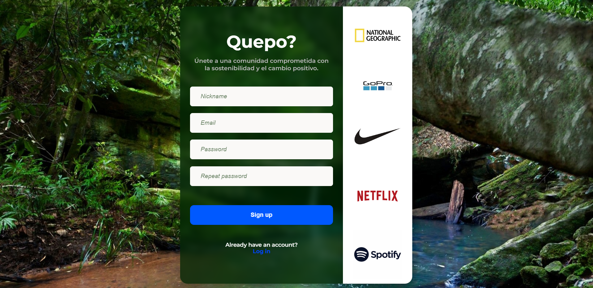
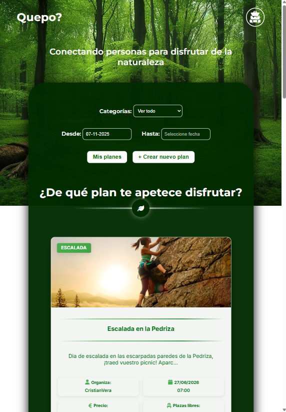
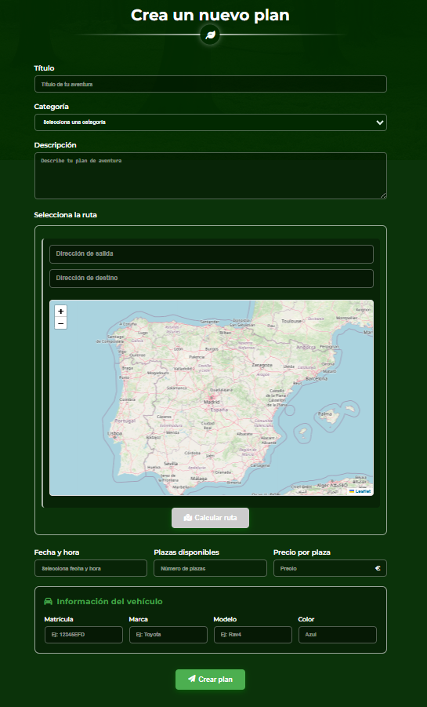

<!-- Banner o título principal -->
<h1 align="center">🧭 QuepoWeb</h1>
<h3 align="center">
  <strong>QuepoWeb</strong> combina tecnología y conciencia ecológica para conectar personas y cuidar el planeta 🌎
</h3>

<p align="center">
  
  
  
  
  
</p>

---

## 🌟 Descripción

Aplicación web que permite a los usuarios **crear o unirse a planes y actividades al aire libre**, compartir coche y fomentar nuevas conexiones sociales, reduciendo así las emisiones contaminantes y la huella de carbono.

---

## 🖼️ Vista previa del proyecto

### 🔑 Pantalla de registro

<p align="center">
  
</p>

<p align="center">
  Accede de forma segura con autenticación JWT y contraseñas cifradas.
</p>

##

### 🏠 Página Principal

<p align="center"> <strong>Vista escritorio 🖥️ &nbsp;&nbsp;·&nbsp;&nbsp;&nbsp;&nbsp;·&nbsp;&nbsp;&nbsp;&nbsp;·&nbsp;&nbsp;&nbsp;&nbsp;·&nbsp;&nbsp;&nbsp;&nbsp;·&nbsp;&nbsp;&nbsp;&nbsp;·&nbsp;&nbsp;&nbsp;&nbsp;·&nbsp;&nbsp; Vista móvil 📱</strong> </p>
<table align="center">
  <tr> <td align="center" width="60%"> 
     
  </td> 
    <td align="center" width="40%"> 
       
    </td>
  </tr> 
</table> 
<p align="center"> Explora planes disponibles o crea el tuyo propio con filtros dinámicos y diseño totalmente responsive. </p>

##

### 🌄 Menú y filtrado de planes

<p align="center">
  
</p>

<p align="center">
  Navegación clara, accesible y moderna con un menú desplegable intuitivo.
</p>

##

### ➕ Creación de un nuevo plan

<p align="center">
  
</p>

<p align="center">
  Añade planes personalizados, elige destino, fecha y comparte con otros usuarios.
</p>

---

## 🚀 Características principales

- 🔐 **Autenticación segura** con JWT y contraseñas cifradas con Argon2.  
- 🔄 **Gestión de rutas protegidas** según el estado de autenticación del usuario.  
- 🧠 **Frontend moderno** con Vue 3, TypeScript, Pinia, Pug y SCSS.  
- ⚙️ **Backend robusto** con Node.js, Express y MongoDB.  
- 🧹 **Código limpio y consistente** gracias a Prettier y ESLint.

---

## 🧩 Tecnologías utilizadas

| Área | Tecnologías |
|------|-------------|
| **Frontend** | Vue 3 · TypeScript · Pinia · Pug · SCSS · Prettier · ESLint |
| **Backend**  | Node.js · Express · MongoDB · JWT · Argon2 |
| **Herramientas** | Git · VS Code · Postman |

---

## ⚙️ Instalación y uso

### 1️⃣ Clonar el repositorio
```bash
git clone https://github.com/CristianVera7/QuepoWeb.git
cd QuepoWeb
```

### 2️⃣ Variables de entorno
Crea un archivo .env dentro de la carpeta back con el siguiente contenido, por ejemplo:
```bash
PORT=8000
URLDB=mongodb://127.0.0.1:27017/quepoDB    
TOKEN_SECRET=TokenTotalmenteSecreto
TOKEN_EXPIRES=18000000
```

### 3️⃣Instalar dependencias
#### 🧩 Frontend
```bash
cd frontend
npm install
npm run dev
```
#### ⚙️ Backend

###### 🔸 En otra terminal:
```bash
cd backend
npm install
```
###### 🔸 En una nueva terminal, ejecuta el servidor TypeScript:
```bash
cd backend
npm run ts
```
###### 🔸 Y en una tercera terminal, levanta el servidor Node:
```bash
cd backend
npm run node
```

---

## 💡 Próximas mejoras

💬 Añadir chat en tiempo real entre usuarios.

💳 Integrar una pasarela de pago.

---

## 👨‍💻 Autor

### Cristian Vera

#### Desarrollador Full Stack

<p align="left">
  📧 <a href="mailto:criisv95@gmail.com">criisv95@gmail.com</a>
  <br/>
  🔗 <a href="https://www.linkedin.com/in/cristian-vera-desarrollador/">LinkedIn: Cristian Vera - Desarrollador</a>
</p>


---

<p align="center">
  🌿 <strong>QuepoWeb</strong> promueve comunidad, conexión y sostenibilidad. 🌿
  <br/>
  💡 Desarrollado con propósito y pasión. 
</p>

